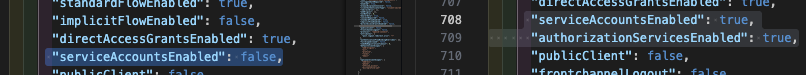

# How to use it?

## Run `python/test`-example

> [!WARNING]
> This is not a fully working example, yet.
> The Goal if this is trying the `python-keycloak`-library and their usage of `UMA` (qwhich is not implemented, yet)

- `docker compose --profile pytest up`
- add a breakpoint somewhere in `python/test/tests/test_keycloak_uma.py`
- attach remote debugger VCS (Run & Debug) "► Python: Remote Debug pytest"
- investigate your breakpoint 🤞 (NOT WORKING, yet)

### TODO

- ~~add `python-keycloak` to requirements~~
- replicate some tests found here https://github.com/marcospereirampj/python-keycloak/tree/master/tests
- do further research!

## Run `python/fastAPI`-example

> [!WARNING]
> This is a WIP, yet

- `docker compose --profile fastapi up`
- attach remote debugger VCS (Run & Debug) "► Remote Debug fastAPI"
- add a breakpoint somewhere in `python/fastAPI/app/main.py`
- Open Browser
    - `http://localhost:8092/private` OIDC browser-flow
        - redirect `http://localhost:9090/realms/myrealm/...` to `Keycloak`
            - `user`/`password`
            - redirects to `http://localhost:8092/callback`
        - redirects to `http://localhost:8092/me` 
        which displays `userinfo` on a simple HTML-page
    - `http://localhost:8092/uma`
- investigate your breakpoint
 
To further check requests with the past `Bearer`-Token to the `/me`-endpoint,
you can open the Browsers -> **Developer Tools** and call the `/verify`-endpoint
with the provided JS function: 
 `request("http://localhost:8092/verify");`

for `UMA` to work please enable in `Keycloak` http://localhost:9090/admin/master/console/

- `myrealm` -> `clients` -> `myclient` -> `Authorization`
- `myrealm` -> `clients` -> `myclient`/`Settings`:
  - enable `Service accounts roles`
  - enable `Authorization`
- `myrealm` -> `clients` -> `myclient` -> `Authorization`

  - have fun! 🥳

## Authorization `on&off`

